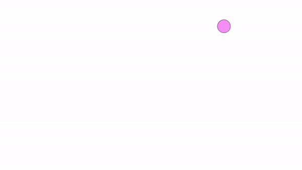

# Repte Processing 2
## Joviat - SDAMV2 - Pol Saña Lázaro 	

# :frog:

**Entrega 1**

> La classe Walker serà l'encarregada de moure els elements de forma aleatoria per la pantalla mitjançant el mètode Walk().
> La classe PVector serà l'encarregada d'afegir, restar, multiplicar o dividir els valors X i Y del objecte.
> També ens servirà per calcular la magnitud i normalitzar-ne el vector.

**Entrega 2**

> Rebot.

**Entrega 3**

> Calculem la magnitud de la línia cridant al mètode del objecte PVector que ens fa el càlcul d'aquesta (sqrt(x*x + y*y)).

**Entrega 4**

> El valor de la magnitud on cop normalitzat el vector és d'entre 0 i 1. Llavors el mutipliquem per 250 per veure'l més bé en la pantalla.
> Un vector unitari és el que representa un valor entre 0 i 1 i que ens dirà la direcció en la que es troba.

**Entrega 5**

>

